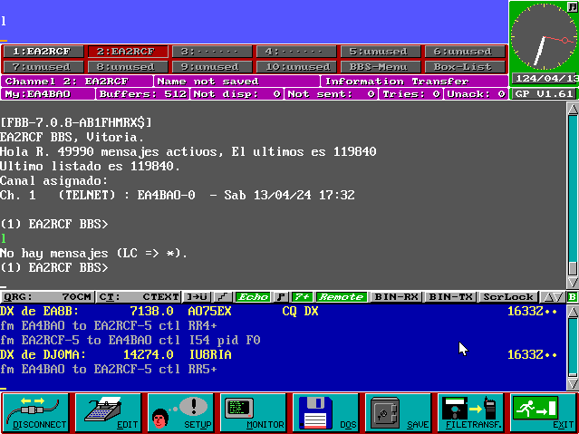
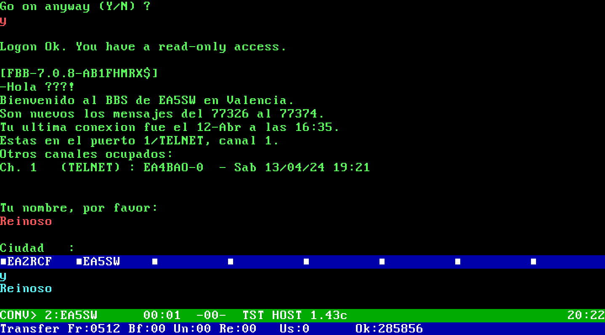
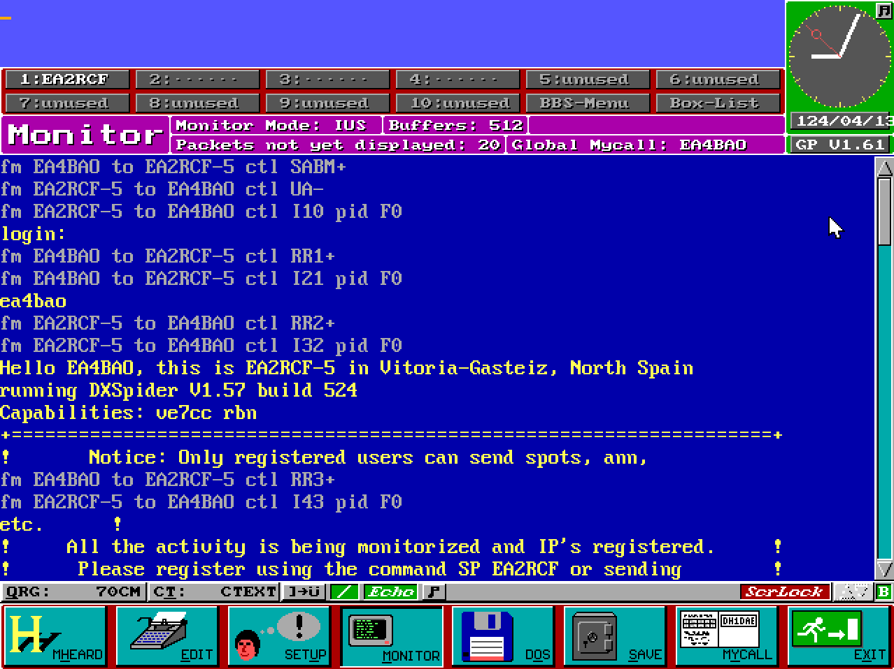
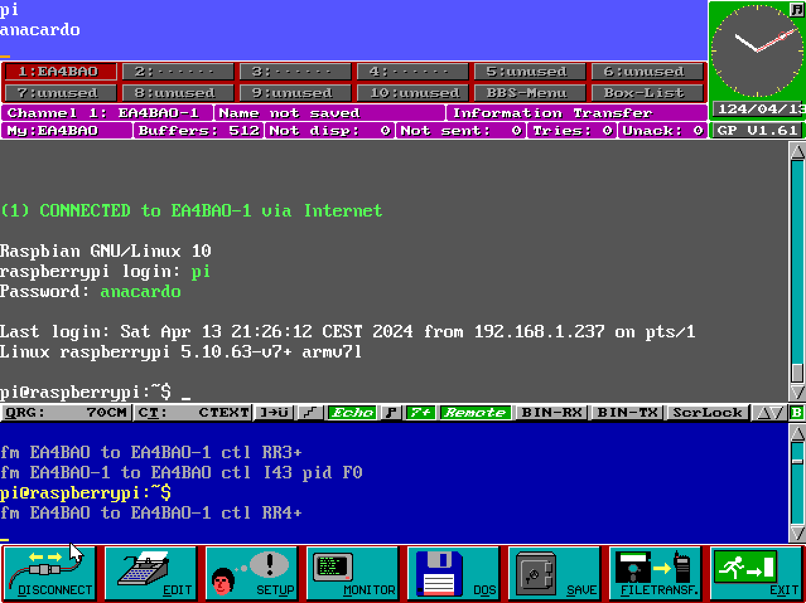
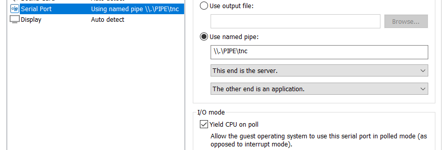
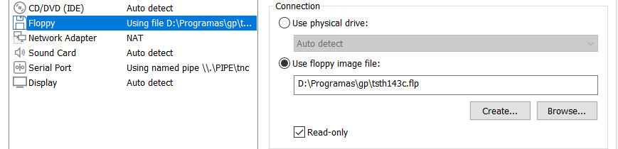

# TNC Telnet

An AX.25 emulator for TCP connections.

This interface emulates WA8DED's *The Firmware* TNC and makes regular Telnet traffic appears like AX.25.

## Description

You can use it to connect to any active F6FBB BBS via **Telnet** using Packet Radio software with support for TNC driver.

Like **Graphic Packet**:




Or **TSTHOST**:



You only need a Virtual Machine with the software, an Internet connection and this program.

The emulator runs in the host system. Guest system's COM port is mapped to a named pipe in the host where this software is listening. See **Setup** section below.

Monitor traffic is also simulated:



Remember this is TCP/IP traffic in reality.

However, since this is basically a telnet client, you can use it to connect to **any** telnet server:




## Usage

### Known stations

Edit `stations.txt` to add data for known stations.

Example:

```
# Callsign      ip or hostname       port
EA4BAO          localhost            6300
EA2RCF          cqnet.dyndns.org     6300
EA2RCF-5        cqnet.dyndns.org     7300
EA5SW           ea5sw.ddns.net       6300
```

This file must be in the same directory where you start the program.
You can also set the path in the command line options.

Format is space-separated. Lines that start with `#` are ignored.

### Command line

If you are using Python, launch it that way:

```
python TNC
```

For help:

```
python TNC -h
```

If you are using precompiled binaries, open a `cmd` window and run:
```
TNCTelnet
```

Do not open it with double clicking until you are familiar with the software.
Chances are that something goes wrong and the terminal window will close faster that you have time
to read what the error was.


## Setup

### Virtual machine

Create a virtual machine. Configure its serial port as a named pipe:



Add a floppy drive.



Get some MS-DOS floppy images. Install the system.

Install and configure your most nostalgic packet program.

### Tips for TSTHOST

1. Configure CKJ driver using `ckbiocfg`. Use COM1, address `3F8H`, IRQ 4.
1. Load the driver in memory running `gkjbios`.
1. Launch TSTHOST like this:

  ```
  TSTHOST /H /C1 /B9600
  ```


### Tips for Graphic Packet

Edit `config.gp` and set the serial speed to 1200 bauds for a realistic experience.

## Caveats

This software only runs on Windows for now. To run it in Linux you'd need to adapt the channel module. TCP sockets error codes are quite different between Linux and Windows.

## Compilation

To create the executable file from the Python sources just run:

```
pyinstaller.exe --onefile TNC\__main__.py -n TNCTelnet
```
